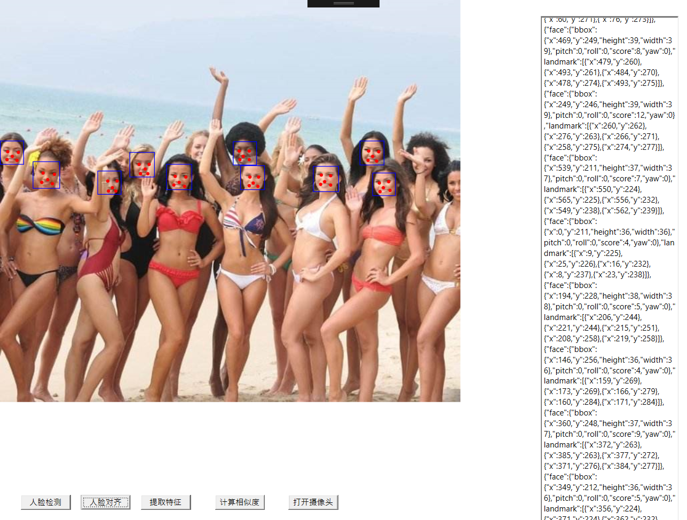

# NSeetaface

## Library
* [Seetaface](https://github.com/iarray/SeetaFaceEngine.Net) 
* [Seetaface .NetDemo](https://github.com/iarray/SeetaFaceEngine.Net) 
* [OpenCV 2.4.12](https://opencv.org/releases.html)

## Download the face models

* FaceAlignment:
		https://github.com/seetaface/SeetaFaceEngine/tree/master/FaceAlignment/model

* FaceDetection:
		https://github.com/seetaface/SeetaFaceEngine/tree/master/FaceDetection/model

* FaceIdentification:
		https://github.com/seetaface/SeetaFaceEngine/tree/master/FaceIdentification/model

## Use
Code Sample:

Init 
初始化
		
	string path = @"d:\model\";	//face models directory path
    SeetafaceHelper.SetModelDirectory(Encoding.Default.GetBytes(path));
    SeetafaceHelper.Init();

FaceDetect 
人脸检测

	SeetafaceHelper.DetectFaces(
        string imagePath,
        StringBuilder detectJsonResult
    );

FaceAlignment 
人脸对齐

	SeetafaceHelper.Alignment(
        string imagePath,
        StringBuilder alignmentResult
    );

ExtractFeature 
提取特征

	SeetafaceHelper.ExtractFeature(string imagePath, AlignmentResult alignmentResult, float[] feats);

Calculating Similarity 
计算相似度

	float[] feat1 = new floar[2048];
	float[] feat2 = new floar[2048];
	
	SeetafaceHelper.ExtractFeature(@"d:\1.jpg", alignmentResult, feat1);
	SeetafaceHelper.ExtractFeature(@"d:\2.jpg", alignmentResult, feat2);

	double sim = SeetafaceHelper.CalcSimilarity(feat1, feat2)
	if(sim > 0.6){
		//.....
	}

## running result 运行结果
